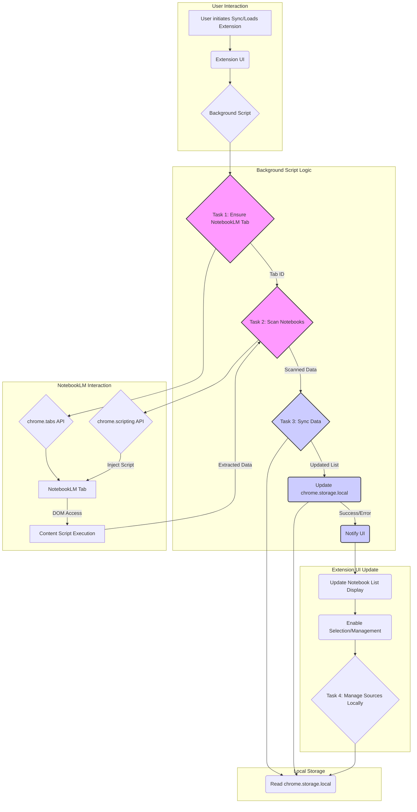

# Phase 3: Notebook Management Implementation Plan

**Overall Goal:** Integrate robust notebook discovery and management capabilities into the extension, syncing with the user's actual NotebookLM notebooks.

**Assumptions:**

*   The Chrome scripting mechanism established in Phase 1 for interacting with NotebookLM (adding sources) is functional and can be adapted for reading notebook data.
*   The `NotebookData` interface defined in `tasklist.md` (lines 128-136) is the target structure for storing notebook information in `chrome.storage.local`.

**Clarifications (Approved):**

1.  **Deleted Notebooks:** When a notebook is removed from NotebookLM, it will be marked as stale (`notebookLM_id = null`) in local storage to preserve locally added sources.
2.  **New Notebook Creation:** Creating a notebook in the extension UI will *only* create it locally in `chrome.storage.local` for this phase.
3.  **Source Management:** Managing sources (add/edit/delete) in the UI is purely a local operation within `chrome.storage.local` for this phase. Syncing these changes back to NotebookLM is deferred.

**Workflow Diagram:**

**Detailed Steps:**

**Task 1: Open NotebookLM in Background Tab (Ref: tasklist.md Lines 116-121)**

1.  **Trigger:** Manual "Sync Notebooks" button in the extension popup UI.
2.  **Check Existing Tabs:**
    *   Implement `ensureNotebookLMTab` in the background script.
    *   Use `chrome.tabs.query({ url: "https://notebooklm.google.com/*" })`.
3.  **Open if Necessary:**
    *   If no tab found, use `chrome.tabs.create({ url: "https://notebooklm.google.com/", active: false })`.
    *   If found, retrieve its `tabId`.
4.  **Return Tab ID:** Return the `tabId` of the NotebookLM tab. Handle errors.

**Task 2: Scan Available Notebooks (Ref: tasklist.md Lines 122-138)**

1.  **DOM Inspection (Manual Step):** Identify selectors for notebook list container, individual items, name/title, and unique ID on `https://notebooklm.google.com/`.
2.  **Content Script for Extraction:**
    *   Create `extractNotebookData` (e.g., in `src/services/notebookLM/domUtils.ts`).
    *   Use selectors to iterate through notebook items, extracting `notebookLM_id` and `notebookLM_title`.
    *   Return an array: `{ notebookLM_id: string, notebookLM_title: string }[]`.
    *   Include error handling.
3.  **Orchestration in Background Script:**
    *   Create `scanNotebookLMNotebooks(tabId)` in the background script.
    *   Use `chrome.scripting.executeScript({ target: { tabId: tabId }, func: extractNotebookData })`.
    *   Await results and handle errors.
    *   Return the array of scanned notebook data.

**Task 3: Sync Notebook Data with Local Storage (Ref: tasklist.md Lines 127-137)**

1.  **Get Scanned and Stored Data:**
    *   In the background script, get scanned data (Task 2) and current notebooks from `chrome.storage.local`.
2.  **Compare and Merge:**
    *   **Scanned vs. Stored:**
        *   **Match Found:** Update `notebookLM_title`, `notebookLM_url` (if possible), `last_sync_datetime` in the stored entry. Preserve other fields.
        *   **No Match (New):** Create a new `NotebookData` object (using scanned ID/title), initialize fields (`created_datetime`, `sources: {}`, `last_sync_datetime`).
    *   **Stored vs. Scanned:**
        *   **No Match (Stale/Deleted):** Set `notebookLM_id = null` and update `last_sync_datetime` in the stored entry (as per approved clarification).
3.  **Save Updated List:** Save the modified list back to `chrome.storage.local`.
4.  **Return Status:** Return success/error status.

**Task 4: Manage Notebooks in Extension UI (Ref: tasklist.md Lines 139-146)**

*   **Display List:** Update UI dropdown to fetch/display the latest list from `chrome.storage.local` after sync. Use `notebookLM_title`. Filter out entries where `notebookLM_id === null`.
*   **Selection:** Ensure selecting a notebook updates the app state correctly.
*   **Create New:** Verify local creation works. Add new entry to `chrome.storage.local` with `notebookLM_id = null` initially.
*   **Manage Sources Locally:**
    *   Enhance "Included Sources" UI for add/edit/delete actions.
    *   These actions modify the `sources` object within the selected `NotebookData` in `chrome.storage.local` *only* for this phase.

**Task 5: Additional Considerations & Testing (Ref: tasklist.md Lines 147-159)**

1.  **User Experience:**
    *   Implement loading indicators during sync.
    *   Provide feedback (e.g., toasts) on sync success/failure.
2.  **Testing:**
    *   Test sync with NotebookLM open/closed/multiple tabs.
    *   Verify create, update, and stale marking logic in `chrome.storage.local`.
    *   Test UI updates and local source management.
    *   Consider edge cases (DOM changes, errors).